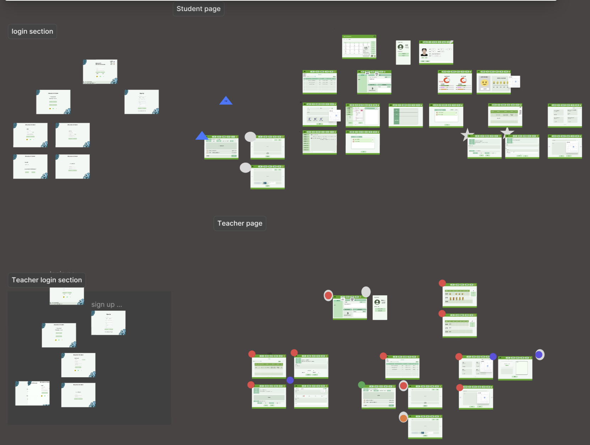

# 챗업스쿨

프로젝트 기간 : 4/1~6/20  
디지털 스마트 부산 AI 프로젝트

## 프로젝트 포스터

## 프로젝트 계획
 1. 주제 선정
 2. 필요한 데이터 수집
 3. ai모델 및 웹 페이지 설계
 4. DB설계 및 테스트

## 프로젝트 선정 배경
 - 글로벌 교육 PC와 타블렛 시장의 성장이 늘어남에 따라 교육 환경이 디지털 학습을 통한 환경으로 변함으로써 학습을 더 효율적으로 할 수 있는 교육 서비스가 필요

 - 교육용 챗봇뿐만이 아니라 학생의 감정을 파악하는 감정 파악 챗봇 기능을 제공하여 학생의 교육을 더 향상시킬 수 있도록 하는 CHATUPSCHOOL 서비스를 구상

## 기능 명세
### 일반 공통 기능
    1. 로그인/회원가입/프로필/유저관리  
### 학생
    1. 과목/ 시간표 등록  
    2. 과제 작성  
    3. 질문게시글 작성  
    4. AI 챗봇 채팅 (교육용/일상 대화용)  
    5. 교육자료 다운로드  
    6. 메모  
### 선생
    1. 과목 생성  
    2. AI 문제 생성  
    3. 교육자료 업로드    
    4. 학생 관리  
    5. 질문 게시글 관리  
    6. 학생 감정분석 기록 조회  
  
## 기술 구상도

## llama3 모델과 파인튜닝
 1. 문제 생성과 대화를 위한 한국어 llm 선택  
    https://huggingface.co/allganize/Llama-3-Alpha-Ko-8B-Instruct  

 2. 학습데이터 수집 출처  
    https://aihub.or.kr/aihubdata/data/view.do?currMenu=115&topMenu=100&dataSetSn=86
    https://aihub.or.kr/aihubdata/data/view.do?currMenu=115&topMenu=100&aihubDataSe=data&dataSetSn=71518  
  
 3. 파인튜닝 
    https://github.com/ggerganov/llama.cpp  
      
 4. 평가 및 추론 테스트  
    - 별도의 GPU가 지원되는 서버에서 테스트(colab)    
    - 개인 서버에서 Flask와 Ngrok으로 api접근 기능 구현  
  	https://github.com/Cuunlang/chatupschool_chatbot.git
  
## 로그인페이지 설계 이유:
1. 사용자 친화적인 인터페이스: 레이아웃이 깔끔하고 정리되어 있어 사용자가 이해하고 탐색하기 쉬움.  
2. 시각적 매력: 차분한 파란색 배경을 사용하여 시각적으로 매력적이고 안정감을 줌. 이는 교육 플랫폼에 이상적.  
3. 브랜딩 및 전문성: 디자인이 전문적이고 신뢰감을 줌. 이는 교육 플랫폼에 중요한 로고와 조직 이름(부산 아카데미)이 포함된 푸터는 브랜딩에 도움이 되며 신뢰성을 높임.  
4. 포용성 및 접근성: 여러 로그인 옵션(소셜 미디어와 전통적인 방법)을 제공하여 다양한 사용자 선호도를 포용. 5. "Teacher"와 "Student" 옵션이 있어 플랫폼이 여러 사용자 유형을 대상으로 하여 개인화된 경험을 제공함.  
6. 기능성: "Remember me" 체크박스와 "Find ID/PW" 링크는 기능성을 추가하여 사용자가 로그인을 쉽게 하고 계정 정보를 복구할 수 있게 함. 명확한 "Sign Up" 링크는 새로운 사용자가 가입하도록 장려하여 사용자 기반을 확대할 수 있음   
7. 언어 변경 기능: 언어 변경 드롭다운 메뉴는 다양한 언어를 사용하는 사용자에게 접근성을 제공. 이는 글로벌 사용자 기반을 고려한 중요한 기능.  
8. 반응형 디자인: 결론적으로, 이 디자인 스타일은 교육 플랫폼에 적합한 사용자 친화적이고 시각적으로 매력적인 깔끔하고 전문적인 모습을 선택한 이유가 있음.   
  
## 플랫폼, API선택 사유  
 1. Supabase의 Authentication (구글,카카오 등으로 로그인 연동)  
 2. 회원, 대시보드 및 파일 데이터는 Supabase DB 이용하여 저장  
 - 기존 로그인 기능을 사용하는  Supabse에서 사용함으로써  데이터 전송 최적화를 통한  API 최소화
 3. SQLAlchemy를 이용한 Supabse연결
 - 특정 DB에 대한 의존성을 줄이고 다양한 DB에서 사용가능하게 ORM으로 설계  
 4. dbconn/model.py에 필요한 data Table을 ORM으로 설계  
 - 기존의 함수와 분리해 DB구조를 직관적으로 확인 가능  
 - 기존 DB와 API를 분리해 필요한 프로젝트에 맞게 API를 재설계   

## 웹 페이지 디자인
- Figma, Bootstrap을 활용하여 학생용/선생님용 ui 제작  
https://www.figma.com/design/bZpRwLJrjpONQQbI9MDv5C/Education-Ai-Chatbot-for-Desktop?node-id=0-1  

  
## 웹 서버 구축
### 1. 사용된 기술  
> - 개발 언어:**python**  
> 백엔드 조원들이 공통적으로 다룰수 있는 언어로 선택  
> - 웹서비스 프레임워크 : **Flask**, **socketio**  
> 파이썬을 사용가능하고 비교적 배우고 다루기 쉬우며 본 프로젝트에 필요한 여러 Api를 설계하기에 용이함  
> 또한 챗봇서버에서 응답을 받아오는 시간이 있어 비동기 통신을 위해 socketio를 병행하여 사용  
  
### 2. 코드 설계  
학생페이지와 선생님페이지를 구분하고 협업 할 때 알아보기 쉽게 하기위해 blueprint 형식으로 구성  
>	dbconn  
> 　|　　⊢　static  
> 　|　　⊢　templates  
> 　|　　⊢　views  
> 　|　　⊢　\__init\__.py  
> 　|　　⊢　connect.py  
> 　|　　⊢　models.py  
> 　|　　⊢　　⋮  
> 　⊢　wsgi.py  
> 　⊢ 　　⋮  
  
- connect.py  
> DB연결, 테이블 생성 및 데이터 수정 코드  
- models.py  
> DB 테이블 정의 ORM  
- wsgi.py  
> wsgi서버 엔트리포인트  
  
### 3. AWS 서버 구축  
서비스 배포를 위한 AWS의 클라우드 서버를 이용하여 웹 서비스 운영 테스트   
- **virtualenv**를 이용한 가상환경 생성  
- 프로젝트에 사용된 라이브러리 설치  
- **gunicorn** 을 이용하여 WSGI서버 실행 및 **nginx**로 프록시 설정  

## 결과

